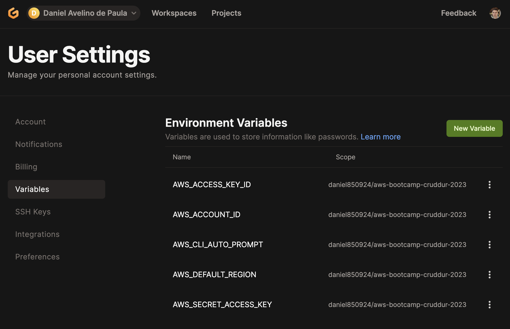
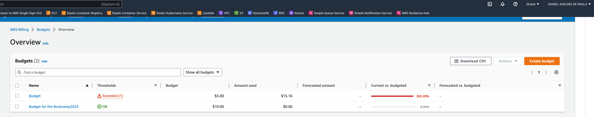

# Week 0 — Billing and Architecture

## Required Homework

## AWS Configure CLI

### AWS CLI Configuration Local

- Instructions to install o local computer [AWS CLI Install](https://docs.aws.amazon.com/cli/latest/userguide/getting-started-install.html)

- Instructions to configure AWS CLI [AWS CLI Configuration](https://docs.aws.amazon.com/cli/latest/userguide/cli-configure-quickstart.html)


### AWS CLI Configuration Gitpod

- Install the AWS CLI when my Gitpod enviroment lanuches using `.gitpod.yml` with the following task

```sh
tasks:
  - name: aws-cli
    env:
      AWS_CLI_AUTO_PROMPT: on-partial
    init: |
      cd /workspace
      curl "https://awscli.amazonaws.com/awscli-exe-linux-x86_64.zip" -o "awscliv2.zip"
      unzip awscliv2.zip
      sudo ./aws/install
      cd $THEIA_WORKSPACE_ROOT
```


### AWS Environment Variables

- Instructions to set AWS environment variables to configure AWS CLI [AWS ENV Variable](https://docs.aws.amazon.com/cli/latest/userguide/cli-configure-envvars.html)

- In order to gitpode remenber these credentials when relaunch the workspace we export the variables

```sh
gp env AWS_ACCESS_KEY_ID=""
gp env AWS_SECRET_ACCESS_KEY=""
gp env AWS_DEFAULT_REGION=us-east-1
```



## Create Diagrams

### Conceptual Diagram

- [Lucid Charts Share Link Conceptual](https://lucid.app/lucidchart/a81b8e8f-e8f2-40b7-a9fc-1c0da45f9588/edit?viewport_loc=-799%2C-469%2C3072%2C1393%2C0_0&invitationId=inv_b9587fc9-31ef-4d1c-a948-01558f8043cc)


### Logical Architectural Deisgn

- [Lucid Charts Share Link Logical](https://lucid.app/lucidchart/cb27dfe2-8cfa-4987-9121-cd819df4b4b5/edit?viewport_loc=-529%2C71%2C3072%2C1393%2C0_0&invitationId=inv_55e22ed6-1fb3-459b-b707-04604e4a1223)


## Create Budgets

### AWS CLI Command to Creat a Budget


### AWS Console Budget Created



## Create SNS

### AWS CLI Command to Creat a SNS


### AWS Console SNS Created


## Create Alarm

### AWS CLI Command to Creat a Alarm


### AWS Console Alarm Created


