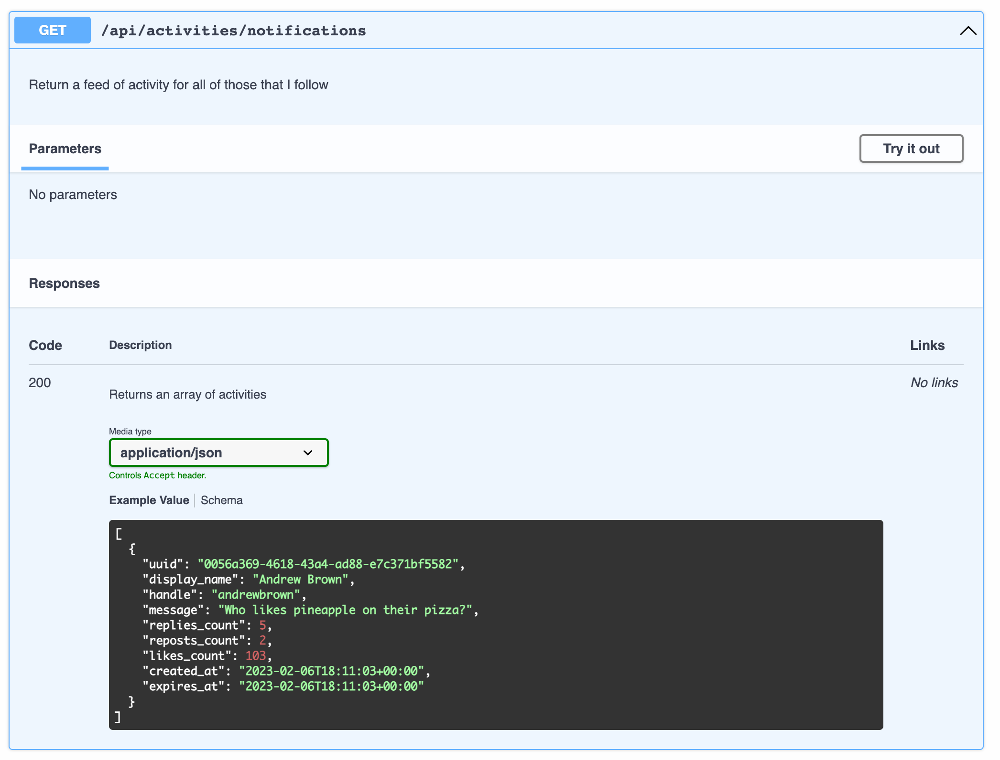

# Week 1 — App Containerization

## Required Homework

## Containerize Application (Dockerfiles, Docker Compose)

### Containerize the backend-flask

- Create the Dockerfile

```dockerfile
FROM python:3.10-slim-buster

WORKDIR /backend-flask

COPY requirements.txt requirements.txt
RUN pip3 install -r requirements.txt

COPY . .

ENV FLASK_ENV=development

EXPOSE ${PORT}
CMD [ "python3", "-m" , "flask", "run", "--host=0.0.0.0", "--port=4567"]
```

- Build backend-flask Container

```sh
docker build -t  backend-flask ./backend-flask
```

- Run backend-flask Container

```sh
docker run --rm -p 4567:4567 -it backend-flask FRONTEND_URL="*" BACKEND_URL="*" docker run --rm -p 4567:4567 -it backend-flask
```

### Containerize the front-react-js

- Create the DockerFile

```dockerfile
FROM node:16.18

ENV PORT=3000

COPY . /frontend-react-js
WORKDIR /frontend-react-js
RUN npm install
EXPOSE ${PORT}
CMD ["npm", "start"]
```

- Run NPM install

```sh
cd frontend-react-js
npm i
```

- Build front-react-js Container

```sh
docker build -t frontend-react-js ./frontend-react-js
```

- Run front-react-js Container

```sh
docker run -p 3000:3000 -d frontend-react-js
```

### Orchestra multiples containers

- Create docker-compose.yml

```yaml
version: "3.8"
services:
  backend-flask:
    environment:
      FRONTEND_URL: "https://3000-${GITPOD_WORKSPACE_ID}.${GITPOD_WORKSPACE_CLUSTER_HOST}"
      BACKEND_URL: "https://4567-${GITPOD_WORKSPACE_ID}.${GITPOD_WORKSPACE_CLUSTER_HOST}"
    build: ./backend-flask
    ports:
      - "4567:4567"
    volumes:
      - ./backend-flask:/backend-flask
  frontend-react-js:
    environment:
      REACT_APP_BACKEND_URL: "https://4567-${GITPOD_WORKSPACE_ID}.${GITPOD_WORKSPACE_CLUSTER_HOST}"
    build: ./frontend-react-js
    ports:
      - "3000:3000"
    volumes:
      - ./frontend-react-js:/frontend-react-js

# the name flag is a hack to change the default prepend folder
# name when outputting the image names
networks:
  internal-network:
    driver: bridge
    name: cruddur
```

- Run multiples Container

```sh
docker compose -f "docker-compose.yml" up -d --build
```

- Stop multiples Container

```sh
docker compose -f "docker-compose.yml" down
```

## Document the Notification Endpoint for the OpenAI Document

- Add the documentation to openapi-3.0.yml

```yaml
/api/activities/notifications:
  get:
    description: "Return a feed of activity for all of those that I follow"
    tags:
      - activities
    parameters: []
    responses:
      "200":
        description: Returns an array of activities
        content:
          application/json:
            schema:
              type: array
              items:
                $ref: "#/components/schemas/Activity"
```

- Documetantion generated

  

## Write a Flask Backend Endpoint for Notifications

- Create the notification end point on app.py

```python
@app.route("/api/activities/notifications", methods=['GET'])
def data_notifications():
data = NotificationsActivities.run()
return data, 200
```

- Import the service

```python
from services.notifications_activities import *
```

- Create the notifications actitivities service

```python
from datetime import datetime, timedelta, timezone
class NotificationsActivities:
  def run():
    now = datetime.now(timezone.utc).astimezone()
    results = [{
      'uuid': '68f126b0-1ceb-4a33-88be-d90fa7109eee',
      'handle':  'coco',
      'message': 'I am white unicorn',
      'created_at': (now - timedelta(days=2)).isoformat(),
      'expires_at': (now + timedelta(days=5)).isoformat(),
      'likes_count': 5,
      'replies_count': 1,
      'reposts_count': 0,
      'replies': [{
        'uuid': '26e12864-1c26-5c3a-9658-97a10f8fea67',
        'reply_to_activity_uuid': '68f126b0-1ceb-4a33-88be-d90fa7109eee',
        'handle':  'worf',
        'message': 'this post has no honor!',
        'likes_count': 0,
        'replies_count': 0,
        'reposts_count': 0,
        'created_at': (now - timedelta(days=2)).isoformat()
      }],
    }
    ]
    return results
```

- Test the new endpoint

## Write a React Page for Notifications

- Map and import the notifications feed page on App.js

```javascript
import NotificationsFeedPage from "./pages/NotificationsFeedPage";
```

```javascript
{
  path: "/notification",
  element: <NotificationsFeedPage />
}
```

- Create the NotificationFeedPage.js [NotificationFeedPage](../frontend-react-js/src/pages/NotificationsFeedPage.js)

- Test the notification menu
