# Week 2 — Distributed Tracing

## Required Homework

- [Instrument Honeycomb with OTEL](#instrument-honeycomb-with-otel)
- [Instrument AWS X-Ray](#instrument-aws-x-ray)
- [Instrument AWS X-Ray Subsegments](#instrument-aws-x-ray)
- [Configure custom logger to send to CloudWatch Logs](#configure-custom-logger-to-send-to-cloudwatch-logs)
- [Integrate Rollbar and capture and error](#integrate-rollbar-for-error-logging)

## Homework Challenges

- [Instrument Honeycomb for the frontend-application to observe network latency between frontend and backend](#instrument-honeycomb-for-the-frontend-application)
- [Add custom instrumentation to Honeycomb to add more attributes eg. UserId, Add a custom span](#add-custom-instrumentation-to-honeycomb-to-add-more-attributes)
- [Run custom queries in Honeycomb and save them later eg. Latency by UserID, Recent Traces](#run-custom-queries-in-honeycomb-and-save-them-later)

## Instrument Honeycomb with OTEL

- Follow the instructions as the documentation [Honeycomb Python Doc](https://docs.honeycomb.io/getting-data-in/opentelemetry/python/)

- Git Commit with the changes [Git Commit c974790](https://github.com/daniel850924/aws-bootcamp-cruddur-2023/commit/c974790bcfacef7ef2856da69aac80971b0af129)

- Honeycomb
  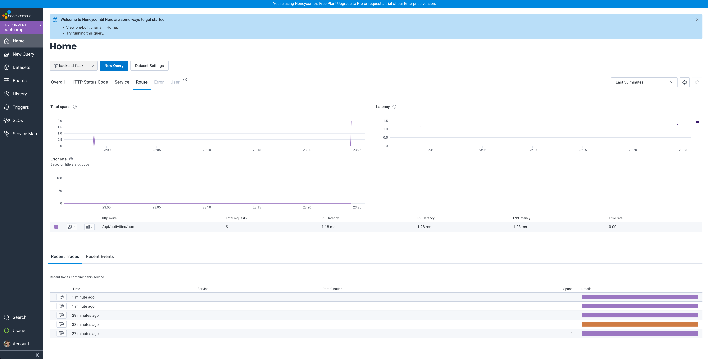

- Honeycomb add spans and attributes [Git Commit 0d25a43](https://github.com/daniel850924/aws-bootcamp-cruddur-2023/commit/3d08ed8005fb4f8642a43d62e718ddaeb6a61675)

- Honeycomb Span/Attributes
  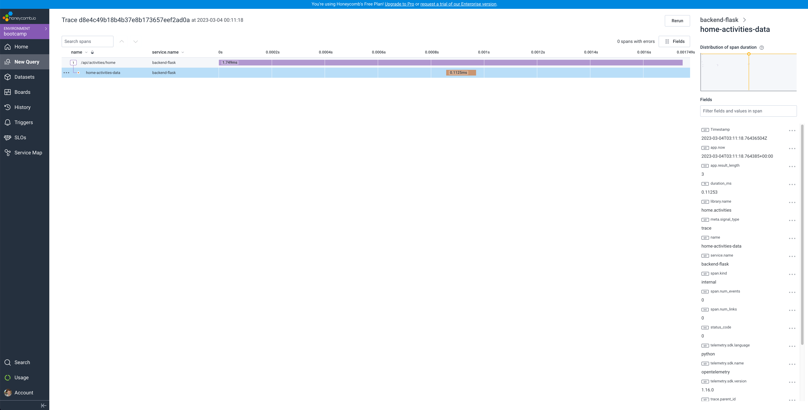

- Run queries to explore traces within Honeycomb.io

- Honneycomb query request with result length greater then two 

- Honneycomb query request with error 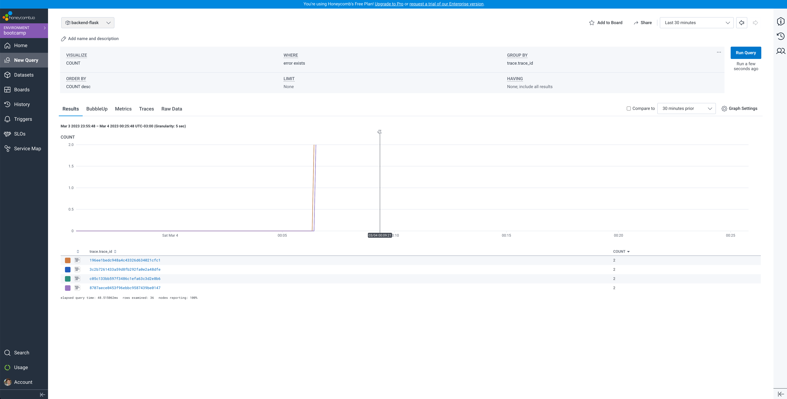

- Honneycomb query request with error detail 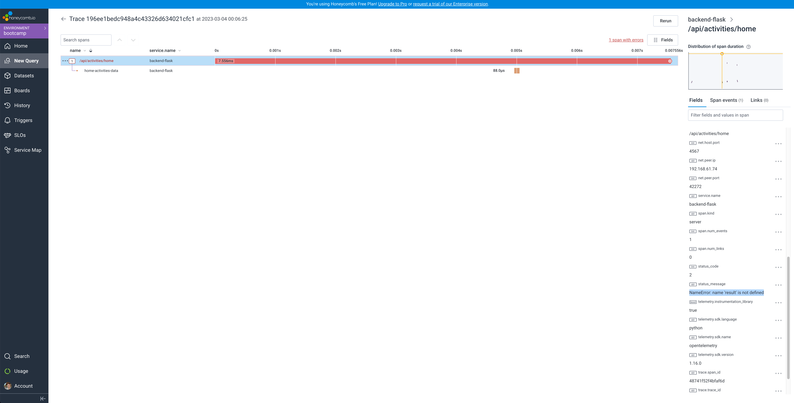

## Instrument AWS X-Ray

- Create X-Ray group through AWS CLI
  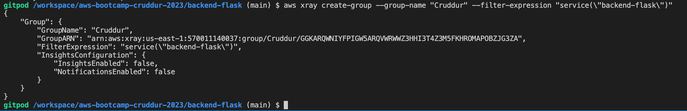
  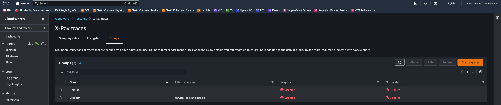

- Create X-Ray sampling rule through AWS CLI
  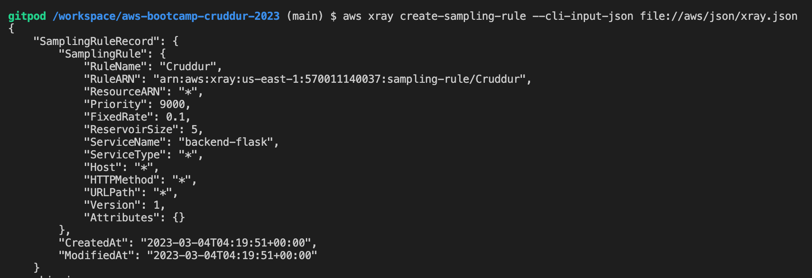

- Configure and provision X-Ray daemon within docker-compose and send data back to X-Ray API [Git Commit e0cff6e](https://github.com/daniel850924/aws-bootcamp-cruddur-2023/commit/e0cff6e6ef87083e51a786a7fffc402a2a3672a8)

- Observe X-Ray traces within the AWS Console

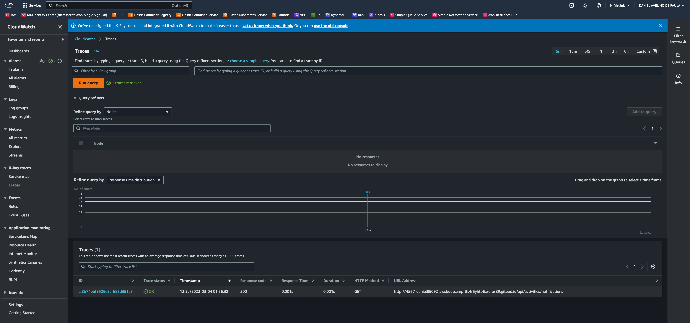

## Configure custom logger to send to CloudWatch Logs

- Git Commit with the changes [Git Commit 4a0c0fe](https://github.com/daniel850924/aws-bootcamp-cruddur-2023/commit/4a0c0fee5ed7b02a4ecce68f52c146d78ed6769b)

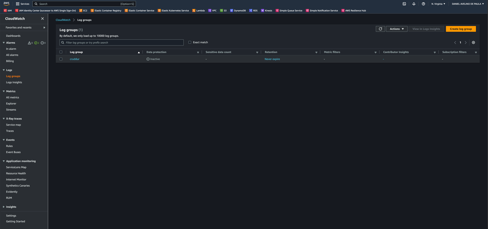
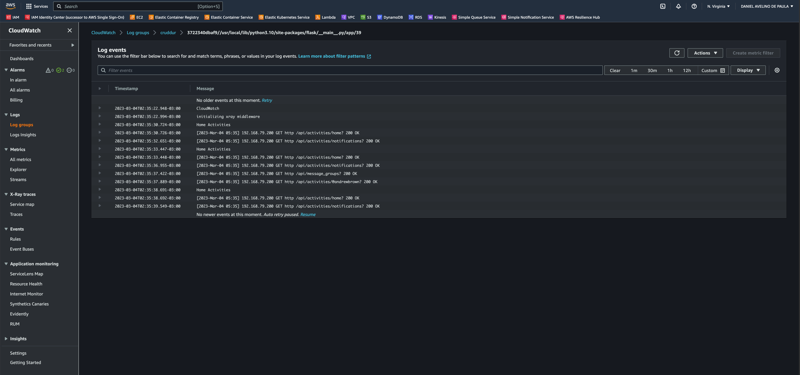

## Integrate Rollbar for Error Logging

- Git Commit with the changes [Git Commit a21f7a6](https://github.com/daniel850924/aws-bootcamp-cruddur-2023/commit/a21f7a67637d41690a9bd54e2cd90032d3124118)

- Trigger an error an observe an error with Rollbar
  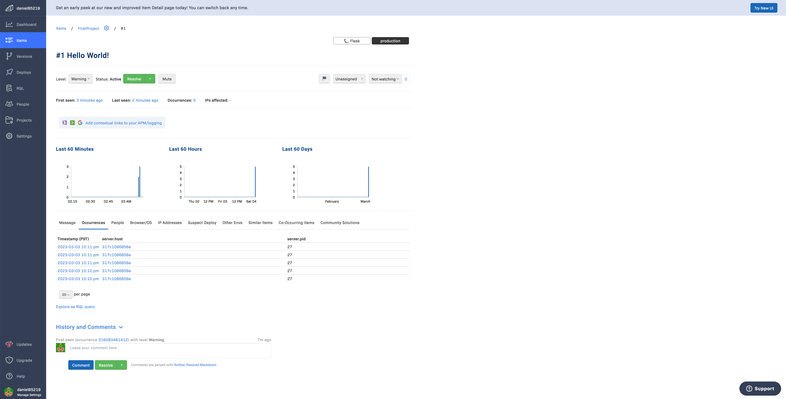
  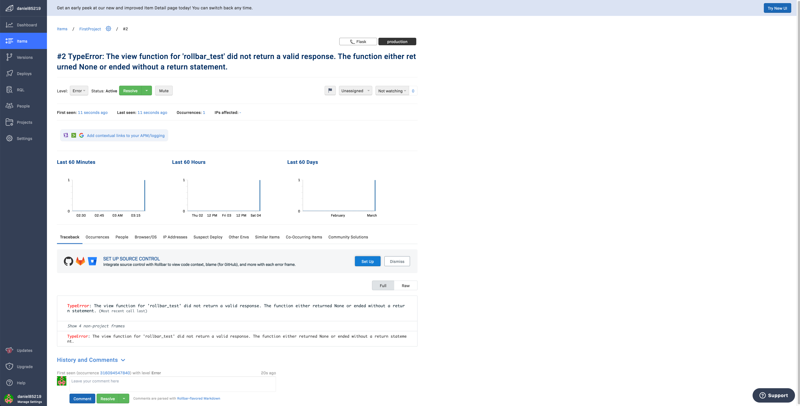

## Instrument Honeycomb for the frontend-application

- Git Commit with the changes [Git Commit 77ed84a](https://github.com/daniel850924/aws-bootcamp-cruddur-2023/commit/77ed84ac50ff75a8d701a167ce7830b8abda8ee0)

- Follow the instructions as the Honyecomb documentation [Honeycomb JavaScript Doc](https://docs.honeycomb.io/getting-data-in/opentelemetry/browser-js/)
- Follow the instructions as the Open Telemetry documentation [Open Telemetry](https://opentelemetry.io/docs/collector/getting-started/)

- The [tracing.js](../frontend-react-js/src/tracing.js) file is imported on the [index.js](../frontend-react-js/src/index.js) them every page in the frontend is now monitored.
- In Honeycomb you can identify the page through the new attribute pageUrlwindow.

## Add custom instrumentation to Honeycomb to add more attributes

- Added document_load span and the attribute pageUrlwindow
  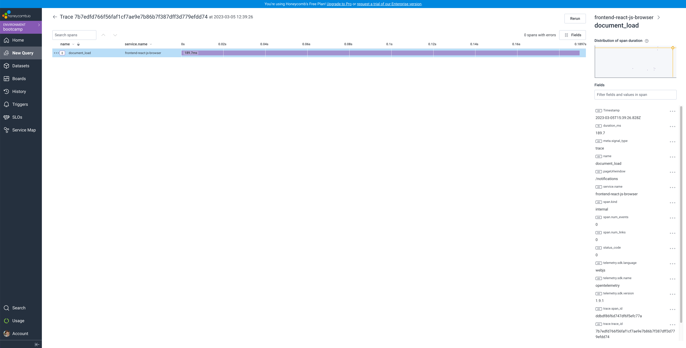

## Run custom queries in Honeycomb and save them later

- Created custom query Notification_Latency and saved it on the board. This query searches in the last two hours for requests on the notification page and shows the time spend to load the page.
  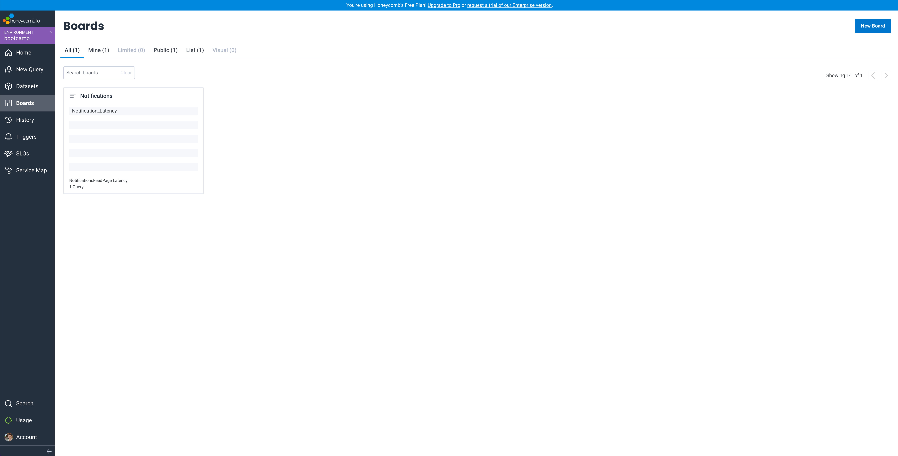

- Running Notification_Latency custom query
  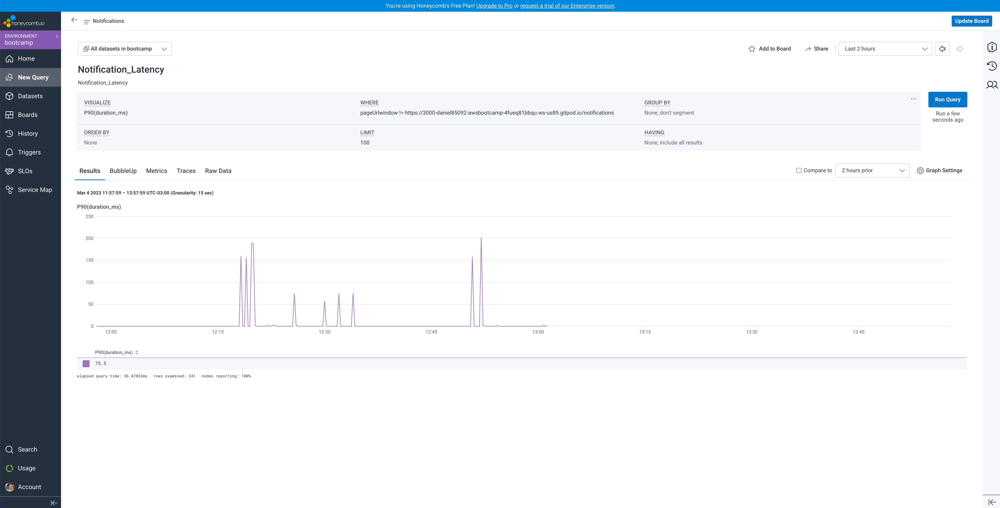
