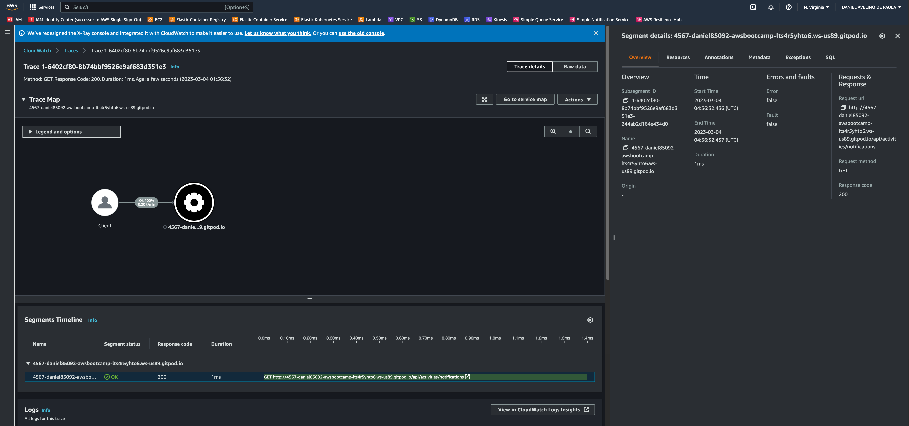

# Week 2 — Distributed Tracing

## Required Homework

## Instrument Honeycomb with OTEL

- Follow the instructions as the documentation [Honeycomb Python Doc](https://docs.honeycomb.io/getting-data-in/opentelemetry/python/)

- Git Commit with the changes [Git Commit c974790](https://github.com/daniel850924/aws-bootcamp-cruddur-2023/commit/c974790bcfacef7ef2856da69aac80971b0af129)

- Honeycomb
  

- Honeycomb add spans and attributes [Git Commit 0d25a43](https://github.com/daniel850924/aws-bootcamp-cruddur-2023/commit/3d08ed8005fb4f8642a43d62e718ddaeb6a61675)

- Honeycomb [notifications_activities.py](../backend-flask/services/notifications_activities.py) Span/Attributes
  

- Run queries to explore traces within Honeycomb.io

- Honneycomb query request with result length greater then two 

- Honneycomb query request with error 

- Honneycomb query request with error detail 

## Instrument AWS X-Ray

- Create X-Ray group through AWS CLI
  
  

- Create X-Ray sampling rule through AWS CLI
  

- Configure and provision X-Ray daemon within docker-compose and send data back to X-Ray API [Git Commit e0cff6e](https://github.com/daniel850924/aws-bootcamp-cruddur-2023/commit/e0cff6e6ef87083e51a786a7fffc402a2a3672a8)

- Observe X-Ray traces within the AWS Console

## Configure custom logger to send to CloudWatch Logs

- Git Commit with the changes [Git Commit 4a0c0fe](https://github.com/daniel850924/aws-bootcamp-cruddur-2023/commit/4a0c0fee5ed7b02a4ecce68f52c146d78ed6769b)

## Integrate Rollbar for Error Logging

- Git Commit with the changes [Git Commit a21f7a6](https://github.com/daniel850924/aws-bootcamp-cruddur-2023/commit/a21f7a67637d41690a9bd54e2cd90032d3124118)

- Trigger an error an observe an error with Rollbar
  
  
